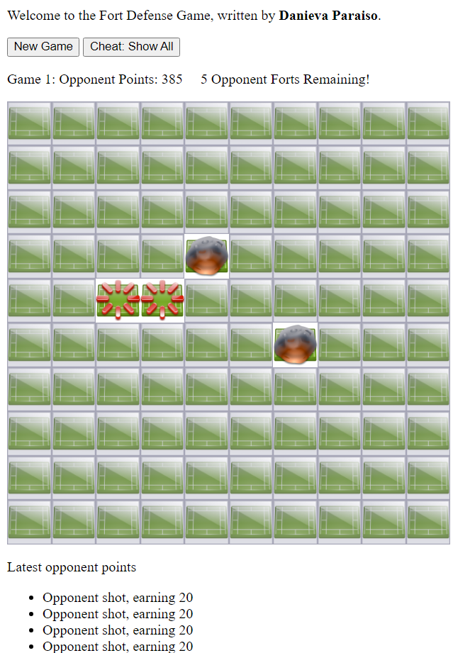

## Fort Game Web Interface
This fort game is reminiscent of battleship with unique variations. 

# How to Play 
The aim of the game is to hit all the opponents forts before the opponents reach a max score of 2500 points and win. 
Each opponent starts with a random polynomio fort which takes up 5 spaces on the game board. Opponents will score on each turn and they will gain points based on how many remaining forts they have. The opponents scores are as follows. 
<ul>
    <li>5 forts - 20 points</li>
    <li>4 forts - 20 points</li>
    <li>3 forts - 5 points</li>
    <li>2 forts - 2 points</li>
    <li>1 forts - 1 points</li>
    <li>0 forts - 0 points</li>
</ul>
A missed fort can be indicated by smoke, whereas a hit is indicated by red ticks in a circle.The gameboard appears as follows during gameplay.  

# Cheat Mode 
For easier gameplay/testing the cheat button can be hit which denotes the placement of all opponents forts with a red diamond. Cheat mode appears as the follows.  

